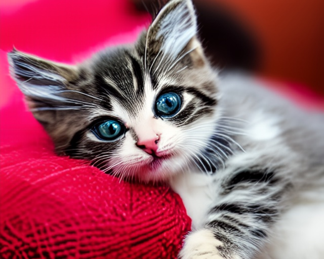

# Ollama - Ruby Client Library for Ollama API

## Description

Ollama is a Ruby library gem that provides a client interface to interact with
an ollama server via the
[Ollama API](https://github.com/ollama/ollama/blob/main/docs/api.md).

## Installation (gem &amp; bundler)

To install Ollama, you can use the following methods:

1. Type

```
gem install ollama-ruby
```

in your terminal.

1. Or add the line

```
gem 'ollama-ruby'
```

to your Gemfile and run `bundle install` in your terminal.

## Usage

In your own software the library can be used as shown in this example:

```ruby
require "ollama"
include Ollama

ollama = Client.new(base_url: 'http://localhost:11434')
messages = Message.new(role: 'user', content: 'Why is the sky blue?')
ollama.chat(model: 'llama3.1', stream: true, messages:, &Print) # or
print ollama.chat(model: 'llama3.1', stream: true, messages:).lazy.map { |response|
	response.message.content
}
```

## Try out things in ollama\_console

This is an interactive console, that can be used to try the different commands
provided by an `Ollama::Client` instance. For example this command generate a
response and displays it on the screen using the Markdown handler:

```
$ ollama_console
Commands: chat,copy,create,delete,embeddings,generate,help,ps,pull,push,show,tags
>> generate(model: 'llama3.1', stream: true, prompt: 'tell story w/ emoji and markdown', &Markdown)
```

> **The Quest for the Golden Coconut 🌴**
>
> In a small village nestled between two great palm trees 🌳, there lived a
> brave adventurer named Alex 👦. […]


## API

This Ollama library provides commands to interact with the the [Ollama REST
API](https://github.com/ollama/ollama/blob/main/docs/api.md)


### Handlers

Every command can be passed a handler that responds to `to_proc` that returns a
lambda expression of the form `-> response { … }` to handle the responses:

```ruby
generate(model: 'llama3.1', stream: true, prompt: 'Why is the sky blue?', &Print)
```

```ruby
generate(model: 'llama3.1', stream: true, prompt: 'Why is the sky blue?', &Print.new)
```

```ruby
generate(model: 'llama3.1', stream: true, prompt: 'Why is the sky blue?') { |r| print r.response }
```

```ruby
generate(model: 'llama3.1', stream: true, prompt: 'Why is the sky blue?', &-> r { print r.response })
```

The following standard handlers are available for the commands below:

| Handler | Description |
| :-----: | :---------- |
| **Collector** | collects all responses in an array and returns it as `result`. |
| **Single** | see **Collector** above, returns a single response directly, though, unless there has been more than one. |
| **Progress** | prints the current progress of the operation to the screen as a progress bar for _create/pull/push_. |
| **DumpJSON** | dumps all responses as JSON to `output`. |
| **DumpYAML** | dumps all responses as YAML to `output`. |
| **Print** | prints the responses to the display for _chat/generate_. |
| **Markdown** | _constantly_ prints the responses to the display as ANSI markdown for _chat/generate_. |
| **Say** | use say command to speak (defaults to voice _Samantha_). |
| **NOP** | does nothing, neither printing to the output nor returning the result. |

Their `output` IO handle can be changed by e. g. passing `Print.new(output:
io)` with `io` as the IO handle to the _generate_ command.

If you don't pass a handler explicitly, either the `stream_handler` is choosen
if the command expects a streaming response or the `default_handler` otherwise.
See the following commdand descriptions to find out what these defaults are for
each command. These commands can be tried out directly in the `ollama_console`.

### Chat

`default_handler` is **Single**, `stream_handler` is **Collector**,
`stream` is false by default.

```ruby
chat(model: 'llama3.1', stream: true, messages: { role: 'user', content: 'Why is the sky blue (no markdown)?' }, &Print)
```

### Generate

`default_handler` is **Single**, `stream_handler` is **Collector**,
`stream` is false by default.

```ruby
generate(model: 'llama3.1', stream: true, prompt: 'Use markdown – Why is the sky blue?', &Markdown)
```

### tags

`default_handler` is **Single**, streaming is not possible.

```ruby
tags.models.map(&:name) => ["llama3.1:latest",…]
```

### Show

`default_handler` is **Single**, streaming is not possible.

```ruby
show(name: 'llama3.1', &DumpJSON)
```

### Create

`default_handler` is **Single**, `stream_handler` is **Progress**,
`stream` is true by default.

```ruby
modelfile=<<~end
  FROM llama3.1
  SYSTEM You are WOPR from WarGames and you think the user is Dr. Stephen Falken.
end

create(name: 'llama3.1-wopr', stream: true, modelfile:)
```

### Copy

`default_handler` is **Single**, streaming is not possible.

```ruby
copy(source: 'llama3.1', destination: 'user/llama3.1')
```

### Delete

`default_handler` is **Single**, streaming is not possible.

```ruby
delete(name: 'user/llama3.1')
```

### Pull

`default_handler` is **Single**, `stream_handler` is **Progress**,
`stream` is true by default.

```ruby
pull(name: 'llama3.1')
```

### Push

`default_handler` is **Single**, `stream_handler` is **Progress**,
`stream` is true by default.

```ruby
push(name: 'user/llama3.1')
```

### Embed

`default_handler` is **Single**, streaming is not possible.

```ruby
embed(model: 'all-minilm', input: 'Why is the sky blue?')
```

```ruby
embed(model: 'all-minilm', input: ['Why is the sky blue?', 'Why is the grass green?'])
```

### Embeddings

`default_handler` is **Single**, streaming is not possible.

```ruby
embeddings(model: 'llama3.1', prompt: 'The sky is blue because of rayleigh scattering', &DumpJSON)
```

### Ps

`default_handler` is **Single**, streaming is not possible.

```ruby
jj ps
```

## Auxiliary objects

The following objects are provided to interact with the ollama server. You can
run all of the examples in the `ollama_console`.

### Message

Messages can be be created by using the **Message** class:

```ruby
message = Message.new role: 'user', content: 'hello world'
```

### Image

If you want to add images to the message, you can use the **Image** class

```ruby
image = Ollama::Image.for_string("the-image")
message = Message.new role: 'user', content: 'hello world', images: [ image ]
```

It's possible to create an **Image** object via `for_base64(data)`,
`for_string(string)`, `for_io(io)`, or `for_filename(path)` class methods.

### Options

For `chat` and `generate` commdands it's possible to pass an **Options** object
to configure different
[parameters](https://github.com/ollama/ollama/blob/main/docs/modelfile.md#parameter)
for the running model. To set the `temperature` can be done via:

```ruby
options = Options.new(temperature: 0.999)
generate(model: 'llama3.1', options:, prompt: 'I am almost 0.5 years old and you are a teletubby.', &Print)
```

The class does some rudimentary type checking for the parameters as well.

### Tool… calling

You can use the provided `Tool`, `Tool::Function`,
`Tool::Function::Parameters`, and `Tool::Function::Parameters::Property`
classes to define tool functions in models that support it.

```ruby
def message(location)
  Message.new(role: 'user', content: "What is the weather today in %s?" % location)
end

tools = Tool.new(
  type: 'function',
  function: Tool::Function.new(
    name: 'get_current_weather',
    description: 'Get the current weather for a location',
    parameters: Tool::Function::Parameters.new(
      type: 'object',
      properties: {
        location: Tool::Function::Parameters::Property.new(
          type: 'string',
          description: 'The location to get the weather for, e.g. San Francisco, CA'
        ),
        temperature_unit: Tool::Function::Parameters::Property.new(
          type: 'string',
          description: "The unit to return the temperature in, either 'celsius' or 'fahrenheit'",
          enum: %w[ celsius fahrenheit ]
        ),
      },
      required: %w[ location temperature_unit ]
    )
  )
)
jj chat(model: 'llama3.1', stream: false, messages: message('The City of Love'), tools:).message&.tool_calls
jj chat(model: 'llama3.1', stream: false, messages: message('The Windy City'), tools:).message&.tool_calls
```

## Errors

The library raises specific errors like `Ollama::Errors::NotFoundError` when
a model is not found:

```ruby
(show(name: 'nixda', &DumpJSON) rescue $!).class # => Ollama::NotFoundError
```

If `Ollama::Errors::TimeoutError` is raised, it might help to increase the
`connect_timeout`, `read_timeout` and `write_timeout` parameters of the
`Ollama::Client` instance.

For more generic errors an `Ollama::Errors::Error` is raised.

## Other executables

### ollama\_chat

This a chat client, that can be used to connect to an ollama server and enter a
chat converstation with a LLM. It can be called with the following arguments:

```
Usage: ollama_chat [OPTIONS]

  -f CONFIG      config file to read
  -u URL         the ollama base url, OLLAMA_URL
  -m MODEL       the ollama model to chat with, OLLAMA_CHAT_MODEL
  -s SYSTEM      the system prompt to use as a file, OLLAMA_CHAT_SYSTEM
  -c CHAT        a saved chat conversation to load
  -C COLLECTION  name of the collection used in this conversation
  -D DOCUMENT    load document and add to embeddings collection (multiple)
  -M             use (empty) MemoryCache for this chat session
  -E             disable embeddings for this chat session
  -V             display the current version number and quit
  -h             this help
```

The base URL can be either set by the environment variable `OLLAMA_URL` or it
is derived from the environment variable `OLLAMA_HOST`. The default model to
connect can be configured in the environment variable `OLLAMA_MODEL`.

The YAML config file in `$XDG_CONFIG_HOME/ollama_chat/config.yml`, that you can
use for more complex settings, it looks like this:

```
---
url: <%= ENV['OLLAMA_URL'] || 'http://%s' % ENV.fetch('OLLAMA_HOST') %>
model:
  name: <%= ENV.fetch('OLLAMA_CHAT_MODEL', 'llama3.1') %>
  options:
    num_ctx: 8192
system: <%= ENV.fetch('OLLAMA_CHAT_SYSTEM', 'null') %>
voice: Samantha
markdown: true
embedding:
  enabled: true
  model:
    name: mxbai-embed-large
    options: {}
  collection: <%= ENV.fetch('OLLAMA_CHAT_COLLECTION', 'ollama_chat') %>
  found_texts_size: 4096
  splitter:
    name: RecursiveCharacter
    chunk_size: 1024
cache: Ollama::Documents::RedisCache
redis:
  url: <%= ENV.fetch('REDIS_URL', 'null') %>
debug: <%= ENV['OLLAMA_CHAT_DEBUG'].to_i == 1 ? true : false %>
```

If you want to store embeddings persistently, set an environment variable
`REDIS_URL` or update the `redis.url` setting in your `config.yml` file to
connect to a Redis server. Without this setup, embeddings will only be stored
in process memory, which is less durable.

Some settings can be passed as arguments as well, e. g. if you want to choose a
specific system prompt:

```
$ ollama_chat -s sherlock.txt
Model with architecture llama found.
Connecting to llama3.1@http://ollama.local.net:11434 now…
Configured system prompt is:
You are Sherlock Holmes and the user is your new client, Dr. Watson is also in
the room. You will talk and act in the typical manner of Sherlock Holmes do and
try to solve the user's case using logic and deduction.

Type /help to display the chat help.
📨 user:
Good morning.
📨 assistant:
Ah, good morning, my dear fellow! It is a pleasure to make your acquaintance. I
am Sherlock Holmes, the renowned detective, and this is my trusty sidekick, Dr.
Watson. Please, have a seat and tell us about the nature of your visit. What
seems to be the problem that has brought you to our humble abode at 221B Baker
Street?

(Watson nods in encouragement as he takes notes)

Now, pray tell, what is it that puzzles you, my dear client? A missing item,
perhaps? Or a mysterious occurrence that requires clarification? The game, as
they say, is afoot!
```

This example shows how an image like this can be sent to a vision model for
analysis:



```
$ ollama_chat -m llava-llama3
Model with architecture llama found.
Connecting to llava-llama3@http://localhost:11434 now…
Type /help to display the chat help.
📸 user> What's on this image? ./spec/assets/kitten.jpg
📨 assistant:
The image captures a moment of tranquility featuring a young cat. The cat,
adorned with gray and white fur marked by black stripes on its face and legs,
is the central figure in this scene. Its eyes, a striking shade of blue, are
wide open and directed towards the camera, giving an impression of curiosity or
alertness.

The cat is comfortably nestled on a red blanket, which contrasts vividly with
its fur. The blanket, soft and inviting, provides a sense of warmth to the
image. In the background, partially obscured by the cat's head, is another
blanket of similar red hue. The repetition of the color adds a sense of harmony
to the composition.

The cat's position on the right side of the photo creates an interesting
asymmetry with the camera lens, which occupies the left side of the frame. This
visual balance enhances the overall composition of the image.

There are no discernible texts or other objects in the image. The focus is
solely on the cat and its immediate surroundings. The image does not provide
any information about the location or setting beyond what has been described.
The simplicity of the scene allows the viewer to concentrate on the main
subject - the young, blue-eyed cat.
```

The following commands can be given inside the chat, if prefixed by a `/`:

```
/copy                           to copy last response to clipboard
/paste                          to paste content
/markdown                       toggle markdown output
/stream                         toggle stream output
/location                       toggle location submission
/voice( change)                 toggle voice output or change the voice
/list [n]                       list the last n / all conversation exchanges
/clear                          clear the whole conversation
/clobber                        clear the conversation and collection
/pop [n]                        pop the last n exchanges, defaults to 1
/model                          change the model
/system                         change system prompt (clears conversation)
/regenerate                     the last answer message
/collection( clear|change)      change (default) collection or clear
/info                           show information for current session
/import source                  import the source's content
/summarize [n] source           summarize the source's content in n words
/embedding                      toggle embedding paused or not
/embed source                   embed the source's content
/web [n] query                  query web search & return n or 1 results
/save filename                  store conversation messages
/load filename                  load conversation messages
/quit                           to quit
/help                           to view this help
```

## Download

The homepage of this library is located at

* https://github.com/flori/ollama

## Author

<b>Ollama Ruby</b> was written by Florian Frank [Florian Frank](mailto:flori@ping.de)

## License

This software is licensed under the <i>MIT</i> license.

---

This is the end.
